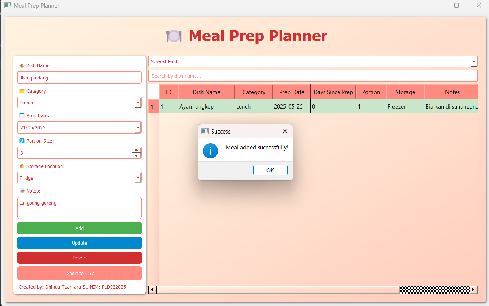

# 🍽️ MEAL PREP PLANNER
Aplikasi Meal Prep Planner adalah aplikasi desktop berbasis PyQt5 yang dirancang untuk mengelola rencana persiapan makanan dengan efisien. Aplikasi ini memungkinkan pengguna untuk menambah, mengubah, dan menghapus data makanan melalui formulir di sisi kiri, sementara data ditampilkan dalam tabel di sisi kanan. Fitur utamanya mencakup pengelompokan makanan berdasarkan kategori (Breakfast, Lunch, Dinner, Snack) dengan warna yang berbeda, penyortiran berdasarkan tanggal persiapan (Newest First atau Oldest First), pencarian berdasarkan nama hidangan, dan ekspor data ke format CSV. Tabel secara otomatis akan menandai makanan yang sudah kadaluarsa (lebih dari 5 hari) dengan warna hitam dan terdapat notes "EXPIRED". Pengguna juga dapat mengklik baris tabel atau menekan tombol edit di bagian paling kanan tabel untuk mengedit data. Proses edit dilakukan melalui formulir di bagian kiri sehingga mendukung pengelolaan data yang terstruktur dan praktis.

## Screenshot Aplikasi

### Tampilan Awal

### Menambahkan Data

#### Peringatan Saat Menambahkan Data Ketika Dish Name Kosong

#### Peringatan Saat Prep Date Melebihi Hari Ini

#### Makanan Expired

### Mencari Data

### Mengedit/Memperbarui Data

### Menghapus Data

#### Hasil Akhir Setelah Menghapus Data

### Mengurutkan Data (Terbaru)

#### Mengurutkan Data (Terlama)

### Export Data ke CSV

#### Berhasil Export

#### Data CSV
